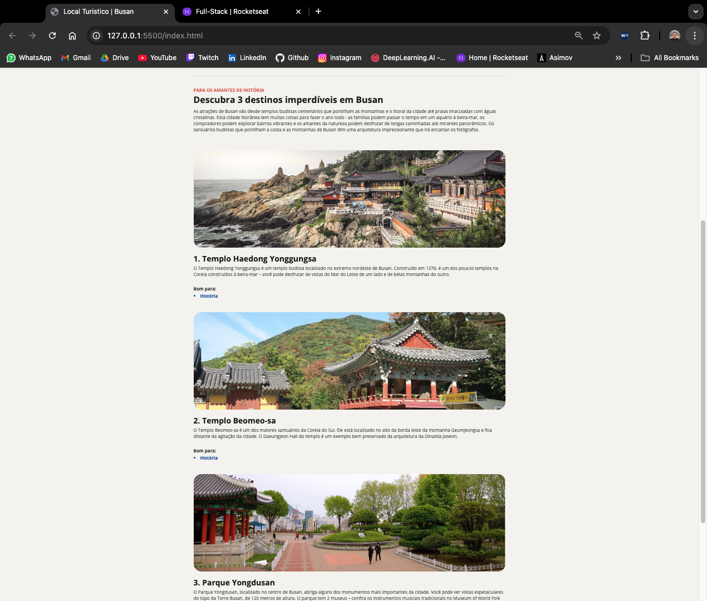

# Landing Page Project

This project is a webpage I created to showcase tourist attractions, designed to practice my HTML and CSS skills. It features a clean, responsive layout inspired by various internet templates. The design highlights my ability to adapt and implement web development techniques, with a focus on creating an aesthetically pleasing and functional user interface.

## Overview

Here is a preview of the page:




## How to Run the Project

1. Clone this repository:
   ```bash
   git clone https://github.com/Victor-Amarante/pagina-local-turistico.git